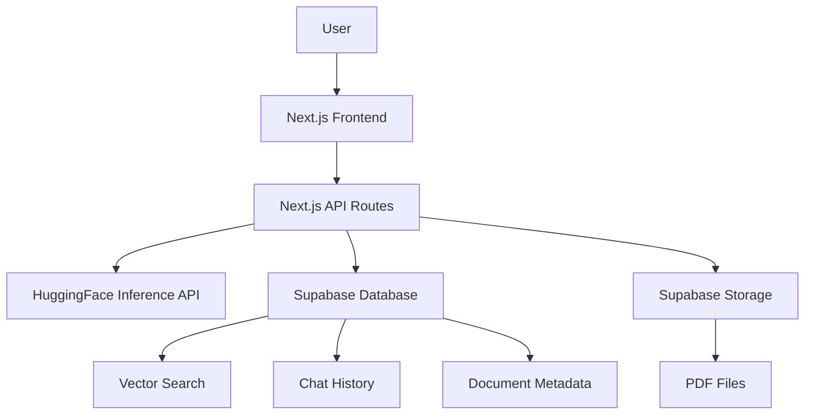

<h1 align="center">
Supesquire
</h1>

<div align="center">
<p align="center">

</p>
</div>

# 📚 Overview

Supesquire is a modern `Next.js` application powered by **HuggingFace** and **Supabase**. It enables intelligent conversations with your PDF documents in real-time using advanced AI models. The application leverages HuggingFace's free inference API with models like `tiiuae/falcon-7b-instruct` for chat responses and `sentence-transformers/all-MiniLM-L6-v2` for embeddings, making it cost-effective and powerful.

## ✨ Key Features

- 🤖 **AI-Powered Chat**: Chat with your PDFs using HuggingFace's state-of-the-art language models
- 📄 **Multi-PDF Support**: Upload and query multiple PDF documents simultaneously
- 🔍 **Smart Search**: Vector-based semantic search across document content
- 📝 **Auto-Summarization**: Automatic document summaries generated after upload
- 💾 **Export Conversations**: Download chat history as TXT or JSON files
- 🔒 **Secure Authentication**: User authentication and data protection via Supabase
- ⚡ **Real-time Updates**: Live chat updates and document processing status
- 🎨 **Modern UI**: Clean, responsive interface built with Material-UI

> Built entirely with JavaScript/TypeScript for maximum accessibility

# 🛠️ Tech Stack

- **HuggingFace 🤗**: Free inference API for LLM chat responses and embeddings generation
  - `tiiuae/falcon-7b-instruct` for conversational AI
  - `sentence-transformers/all-MiniLM-L6-v2` for document embeddings
- **Supabase 🛢️**: User authentication, PDF storage, real-time communication, document metadata, chat history, and vector database
- **Langchain ⛓️**: Document processing, text splitting, prompt engineering, and LLM orchestration
- **Next.js 13+ ⚛️**: Full-stack React framework with App Router, API routes, and server-side rendering
- **Material-UI 🎨**: Component library for modern, responsive UI design
- **Vercel 🚀**: Deployment platform optimized for Next.js applications

## 🏷️ Architecture



# 🛢️ Prerequisites

## HuggingFace Setup
1. Create a free account at [HuggingFace](https://huggingface.co/)
2. Generate an API key from [Settings > Access Tokens](https://huggingface.co/settings/tokens)
3. The application uses HuggingFace's free inference API - no paid subscription required!

## Supabase Setup
1. Create a [Supabase project](https://supabase.com/dashboard/new)
2. Enable [Row Level Security (RLS)](https://supabase.com/docs/guides/auth/row-level-security)
3. Create a new user in your Supabase project with a valid email and password
4. Execute the queries from [supabase.sql](supabase.sql) in Supabase's SQL Editor to create required tables and storage buckets

# 🚀 Local Development Setup

## Prerequisites
- Node.js 18+ 
- npm or yarn
- Git

## Installation Steps

1. **Clone the repository**
   ```bash
   git clone <repository-url>
   cd supesquire-main
   ```

2. **Install dependencies**
   ```bash
   npm install
   # or
   yarn install
   ```

3. **Environment Configuration**
   Create a `.env` file in the root directory with the following variables:
   
   ```env
   # HuggingFace Configuration
   HF_API_KEY=your_huggingface_api_token
   
   # Supabase Configuration
   NEXT_PUBLIC_SUPABASE_URL=your_supabase_project_url
   NEXT_PUBLIC_SUPABASE_ANON_KEY=your_supabase_anon_key
   NEXT_PUBLIC_SUPABASE_BUCKET=documents
   NEXT_PUBLIC_SUPABASE_DOCUMENTS_TABLE=documents
   NEXT_PUBLIC_SUPABASE_CHAT_RECORDS_TABLE=chat_records
   NEXT_PUBLIC_SUPABASE_VECTOR_MATCHING_FUNCTION=match_documents
   NEXT_PUBLIC_SUPABASE_DOCUMENT_CHUNKS_TABLE=document_chunks
   ```

4. **Start the development server**
   ```bash
   npm run dev
   # or
   yarn dev
   ```

5. **Open your browser**
   Navigate to [http://localhost:3000](http://localhost:3000) to see the application

# 🐳 Docker Setup

The project includes Docker support for containerized deployment:

```bash
# Build the Docker image
docker build -t supesquire:latest .

# Run with environment file
docker run -p 3000:3000 --env-file .env supesquire:latest

# Or run with individual environment variables
docker run -p 3000:3000 \
  -e HF_API_KEY=your_hf_key \
  -e NEXT_PUBLIC_SUPABASE_URL=your_supabase_url \
  -e NEXT_PUBLIC_SUPABASE_ANON_KEY=your_supabase_key \
  supesquire:latest
```

# 🌍 Deployment

## Vercel (Recommended)

Supesquire is optimized for deployment on Vercel:

1. **Connect your repository** to [Vercel](https://vercel.com/)
2. **Set environment variables** in your Vercel project settings
3. **Deploy** - Vercel will automatically build and deploy your application

```bash
# Or deploy via Vercel CLI
npm i -g vercel
vercel --prod
```

## Other Platforms

- **Netlify**: Use `npm run build` and deploy the `.next` folder
- **Railway**: Connect your GitHub repository
- **Heroku**: Use the included Dockerfile
- **DigitalOcean App Platform**: Deploy directly from GitHub

# 📝 How to Use

## 📄 Uploading Documents

1. **Single PDF**: Drag and drop a PDF file onto the upload area
2. **Multiple PDFs**: Select or drag multiple PDF files at once
3. **Processing**: Wait for the application to extract text and generate embeddings
4. **Auto-Summary**: Documents are automatically summarized after processing

## 💬 Chat Features

### Smart Conversations
- Ask questions about your uploaded documents
- Get contextually relevant answers from the AI
- Reference specific parts of your documents

### Advanced Queries
- **Lists**: "List the main features of..."
- **Summaries**: "Summarize the key points about..."
- **Code**: "Show me the code example for..."
- **Comparisons**: "What are the differences between..."

### Export Options
- **Chat History**: Click the export button to download your conversation
- **Formats**: Available in TXT and JSON formats
- **Original PDF**: Download the original document anytime

## 🔍 Search Functionality

Use the global search to:
- Find information across all your documents
- Get quick answers without starting a full conversation
- Locate specific topics or concepts

# 📊 Features Deep Dive

## Multi-PDF Support
- Upload up to multiple PDFs simultaneously
- Query across all documents in one conversation
- Each document is independently processed and summarized

## AI-Powered Summarization
- Automatic summaries generated using HuggingFace LLM
- Summaries stored in Supabase for quick access
- Background processing doesn't block the UI

## Vector Search
- Semantic search using sentence transformers
- Find relevant content even with different wording
- Powered by Supabase's vector database capabilities

## Real-time Updates
- Live processing status updates
- Real-time chat responses
- Instant notifications for uploads and errors

# 🔧 Troubleshooting

## Common Issues

### PDF Processing Errors
- **Encrypted PDFs**: Remove password protection before uploading
- **Scanned PDFs**: Use OCR tools to convert to searchable text first
- **Large Files**: Files over 10MB may take longer to process

### HuggingFace API Issues
- **Rate Limits**: Free tier has usage limits - consider upgrading for production
- **Model Availability**: Some models may have temporary downtime
- **API Key**: Ensure your HF_API_KEY is valid and has proper permissions

### Supabase Connection
- **RLS Policies**: Ensure proper Row Level Security policies are set
- **CORS**: Check CORS settings in Supabase dashboard
- **Quotas**: Monitor your Supabase usage and quotas

## Performance Tips

- **Chunk Size**: Optimal PDF chunk size is 5000 characters
- **Concurrent Uploads**: Limit simultaneous uploads to avoid API rate limits
- **Browser**: Use modern browsers for best performance (Chrome, Firefox, Safari, Edge)

# 📝 Usage Examples

## Academic Research
```
User: "List the main methodologies used in this research paper"
AI: "Based on the document, here are the main methodologies:
• Quantitative analysis using statistical models
• Qualitative interviews with 50 participants  
• Literature review spanning 2010-2023
• Cross-sectional survey design"
```

## Technical Documentation
```
User: "Show me how to implement the authentication flow"
AI: "Here's the authentication implementation from the documentation:

```javascript
const authenticate = async (credentials) => {
  const response = await fetch('/api/auth', {
    method: 'POST',
    body: JSON.stringify(credentials)
  });
  return response.json();
};
``` 

This function handles user login by sending credentials to the auth endpoint."
```

## Legal Documents
```
User: "What are the key terms and conditions?"
AI: "The main terms and conditions include:

1. **Service Usage**: Limited to authorized users only
2. **Data Protection**: Personal information handled per GDPR
3. **Liability**: Company liability limited to subscription amount
4. **Termination**: Either party may terminate with 30-day notice"
```

# 🔌 API Endpoints

## Core Endpoints

- **POST** `/api/extract-pdf` - Extract text content from uploaded PDF
- **POST** `/api/process-document` - Process and store document with embeddings
- **POST** `/api/inference` - Generate AI responses for chat queries
- **POST** `/api/summarize` - Generate document summaries
- **POST** `/api/export-chat` - Export conversation history
- **POST** `/api/chat-records` - Fetch chat history for a document
- **POST** `/api/search` - Global document search

## Authentication
- All endpoints require valid Supabase authentication
- Users can only access their own documents and chat history

# 👥 Contributing

We welcome contributions! Here's how you can help:

## Development Setup
1. Fork the repository
2. Create a feature branch: `git checkout -b feature/amazing-feature`
3. Make your changes and test thoroughly
4. Commit your changes: `git commit -m 'Add amazing feature'`
5. Push to the branch: `git push origin feature/amazing-feature`
6. Open a Pull Request

## Areas for Contribution
- 🔍 **PDF Processing**: Improve PDF text extraction and parsing
- 🤖 **AI Models**: Experiment with different HuggingFace models
- 🎨 **UI/UX**: Enhance the user interface and experience
- 🚀 **Performance**: Optimize application performance and loading times
- 📝 **Documentation**: Improve documentation and examples
- 🔧 **Testing**: Add comprehensive tests for components and API routes

## Code Style
- Use ESLint and Prettier for code formatting
- Follow React best practices and hooks patterns
- Write descriptive commit messages
- Add comments for complex logic

# 📋 Changelog

## Version 2.0.0 (Latest)

### ✨ New Features
- **HuggingFace Integration**: Migrated from OpenAI to HuggingFace free inference API
- **Multi-PDF Upload**: Support for uploading and processing multiple PDFs simultaneously
- **Auto-Summarization**: Automatic document summaries generated after upload
- **Chat Export**: Download conversation history in TXT or JSON format
- **Enhanced Error Handling**: User-friendly error messages and better error recovery

### 🔧 Technical Improvements
- Fixed DOM manipulation errors in PDF processing
- Resolved webpack canvas dependencies issues
- Updated Langchain imports to latest version
- Improved build system and deployment readiness
- Added comprehensive error handling and logging

### 🐛 Bug Fixes
- Fixed `removeChild` DOM manipulation errors
- Resolved PDF.js canvas compatibility issues
- Fixed embedding generation and vector search
- Improved chat history persistence

## Version 1.0.0 (Previous)
- Initial release with OpenAI integration
- Basic PDF upload and chat functionality
- Supabase authentication and storage
- Vector search and document Q&A

# 📦 License

This project is licensed under the MIT License - see the [LICENSE](LICENSE) file for details.

# 🙏 Acknowledgments

- **HuggingFace** for providing free AI inference APIs
- **Supabase** for the excellent backend-as-a-service platform
- **Vercel** for seamless Next.js deployment
- **Langchain** for AI orchestration and document processing tools
- **Material-UI** for the beautiful component library

# 📞 Support

If you encounter any issues or have questions:

1. **Check the [Troubleshooting](#-troubleshooting) section**
2. **Search existing [Issues](issues) on GitHub**
3. **Create a new issue** with detailed information about your problem
4. **Join our community discussions**

---

<div align="center">

**Built with ❤️ by the Supesquire team**

[Live Demo](https://your-demo-url.com) • [Documentation](https://your-docs-url.com) • [Report Bug](issues) • [Request Feature](issues)

</div>
# Quanta-Read

